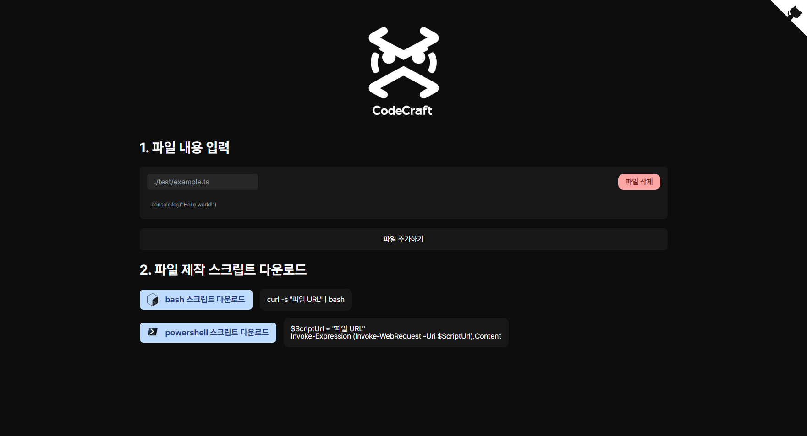

# Code Craft

## Overview

**Code Craft** is a versatile tool designed to streamline the development setup process for developers. By allowing users to input their frequently used code, **Code Craft** generates Bash and PowerShell scripts that can be downloaded and executed. This functionality enables automatic creation of folders and files, simplifying the initial setup for projects across different environments.

## Features

- **Nested Folder Support:** Easily organize your project structure with support for nested folders. This feature allows for the creation of complex directory hierarchies with a simple command, ensuring your project's organization is both efficient and scalable.

- **Code Editor:** A built-in code editor provides the convenience of editing and reviewing your scripts within the application. This feature ensures that your code is ready to be transformed into scripts without the need for external editors.

- **Environment-Specific Scripts:** Catering to the diverse needs of the development community, **Code Craft** offers script generation for multiple environments, including Windows (PowerShell) and Unix-based systems (Bash for Linux and Mac). This ensures that no matter your operating system, you can benefit from the streamlined setup process.

## Getting Started

To get started with Code Craft, follow these simple steps:

1. **Visit the Website**: Start by visiting [https://craft-code.vercel.app/](https://craft-code.vercel.app/) to access the Code Craft tool.

2. **Input Your Code**: Input the code you frequently use in the provided code editor. This can include anything from basic file structures to complex project setups.

3. **Generate Scripts**: Once your code is inputted, select the target environment for your script - Windows (PowerShell) or Unix-based (Bash). Code Craft will then generate the appropriate script for download.

4. **Execute Script**: Download the generated script and execute it on your system. This will automatically create the folders and files as per your specifications, ready for use in your project.

## Contribution

**Code Craft** is open to contributions! If you have suggestions for improvements or new features, feel free to fork the repository and submit a pull request. Your input is invaluable in making **Code Craft** more versatile and user-friendly.

## License

**Code Craft** is released under the MIT License. Feel free to use, modify, and distribute the software as per the license terms.

Thank you for choosing **Code Craft** for your development setup needs. Happy coding!
